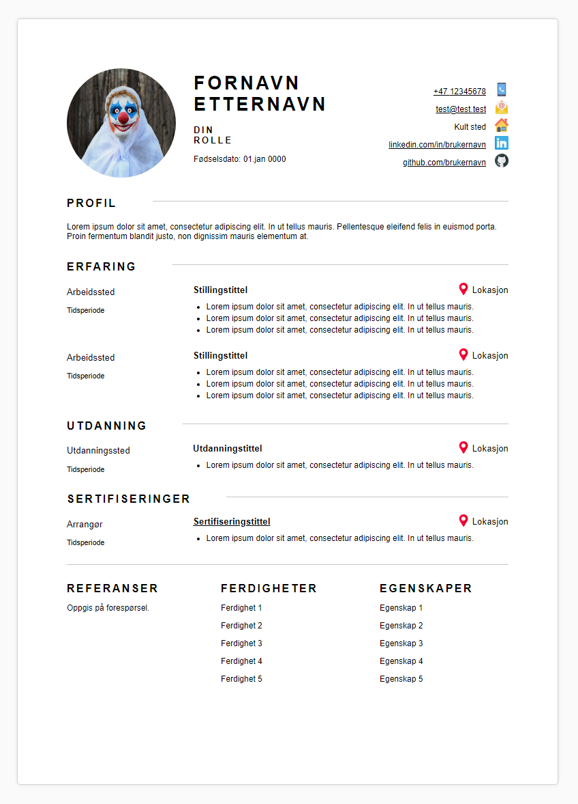

## Disclaimer
Code is not yet optimized

## How to make changes

- Change public/images/portrait.png to your own portrait with same filename.

- Change src/data/cv.json to your own personal information

## Available Scripts

In the project directory, you can run:

### `npm i`
Install all dependencies

### `npm start`

Runs the app in the development mode.\
Open [http://localhost:3000](http://localhost:3000) to view it in the browser.

## Preview of CV

